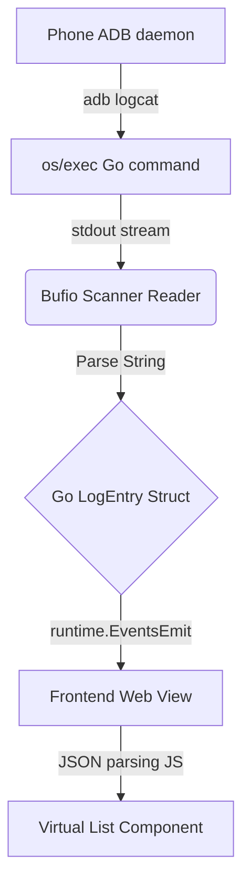

# SPECIFICATIONS: Logcat Viewer

## 1. Executive Summary
Xây dựng tính năng Xem Log real-time lấy cảm hứng từ Android Studio Logcat v2, tích hợp gốc liền mạch trong Desktop App ApkBuilder (Viết bằng Go/Wails). Mục đích tiết kiệm thời gian test và không cần cài thêm cấu trúc IDE bên ngoài.

## 2. User Stories
- Developer: Muốn thấy Log In-App và lọc riêng cho Package của tôi (App đang debug) để tránh rác log thiết bị.
- QA: Dễ dàng thấy LogCrash báo đỏ với đường dẫn Stacktrace, chỉ chụp phần có Error.
- General: Giao diện không đứng, không giật lag khi điện thoại nhả Log như thác đổ tốc độ 500 dòng/s.

## 3. Architecture Design


## 4. API Contract (Go Struct)
```go
type LogEntry struct {
    Timestamp string `json:"timestamp"`
    PID       string `json:"pid"`
    TID       string `json:"tid"`
    Level     string `json:"level"`    // V, D, I, W, E, F
    Tag       string `json:"tag"`
    Message   string `json:"message"`
}
```

## 5. UI Components
- **Top Control Bar:** Select Device dropdown, Filter Dropdown, Pause Btn, Clear Btn, Export Btn.
- **Advanced Query Input:** TextField để gõ filter tuỳ biến `message:bla tag:blo`.
- **Log Table Grid:** 
  - Render theo nguyên tắc Windowing. 
  - Cột chia đều, Background đan xen tối sáng (Zebra row) nếu cần.
  - Phân màu sắc Font level Error(Đỏ), Warn(Vàng), Info(Xanh dương/Lục).
